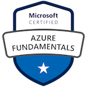
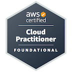
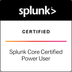
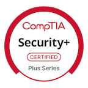
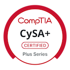
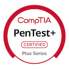
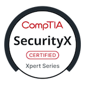

# 👋 Hi, I’m Sadie

## 🚀 System Engineer | Python • Splunker • Cloud

I am an avid learner of technology, always curious about the latest advancements in the field. My passion lies in experimenting with new tools and resources, and I enjoy helping my team drive efficiency through automation.

---

### 🛠️ Core Skills

- **Splunk Dashboards**
- **Python Scripting & Automation**
- **DevOps Practices & CI/CD**
- **Cloud Solutions & Infrastructure**

---

### 📈 Notable Projects

All of my projects are notable—each one reflects my commitment to quality, innovation, and reliable automation.

---

### 🌱 What Drives Me

> “Continuous learning and experimentation fuel my approach to engineering. I believe in leveraging technology to solve real-world problems and empower teams through smart automation.”

---

### 📝 Read My Blog

Stay updated with my technical insights and automation tips at  
[TechSavvySadie.substack.com](https://TechSavvySadie.substack.com)

---
### Certifications

<!--
**zerotrustprivacy/zerotrustprivacy** is a ✨ special ✨ repository because its README.md appears on your GitHub profile.
-->
